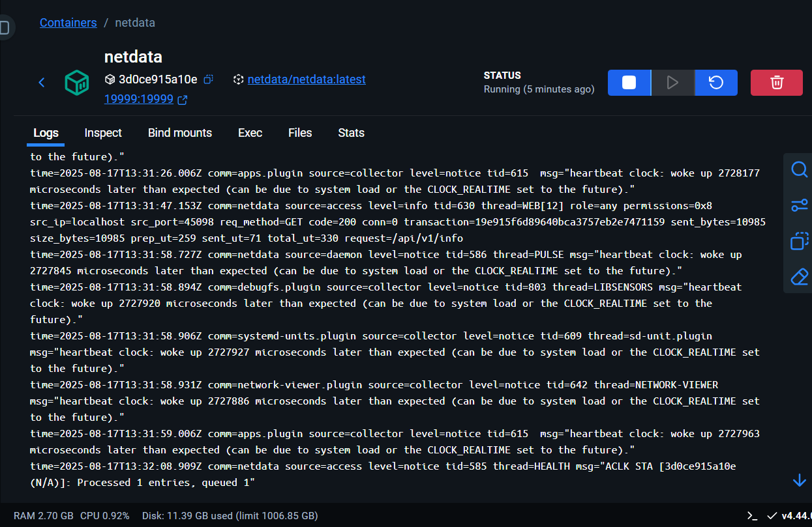
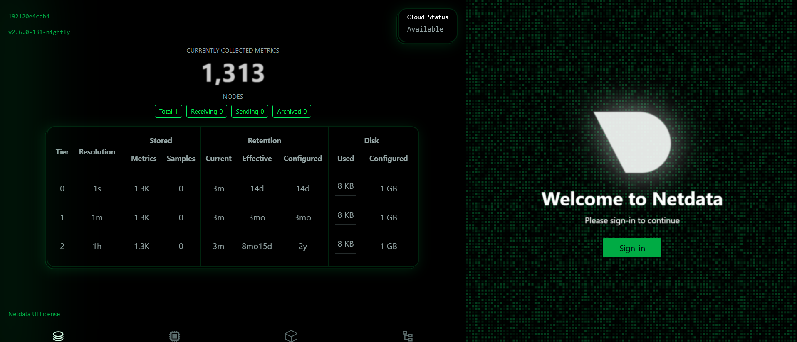
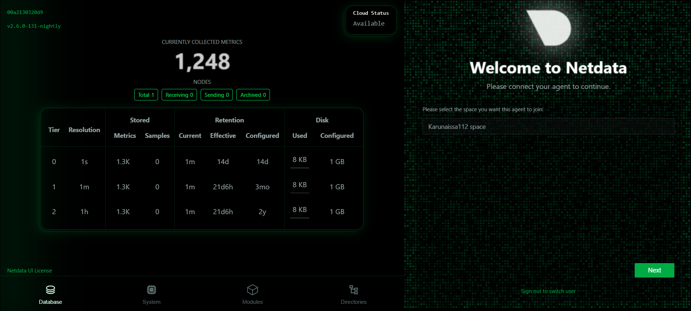
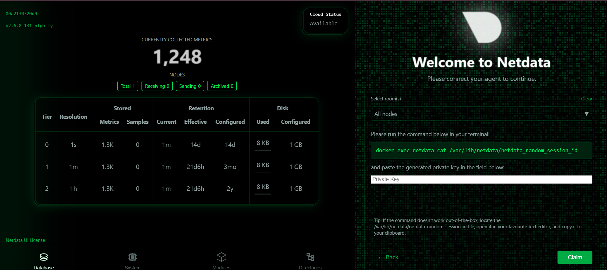
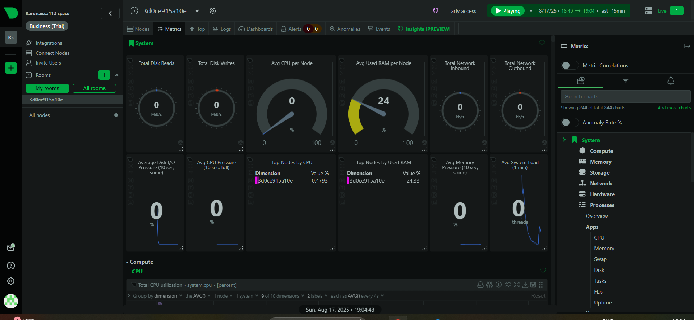

# Monitor System Resources Using Netdata

## install netdata in your system 
sudo add-apt-repository universe
sudo apt update

## Install Netdata directly using APT
sudo apt install netdata
## Enable and start the Netdata service:
sudo systemctl enable --now netdata

## Run netdata in docker container 
 docker run -d --name netdata -p 19999:19999 -v /var/log:/host/var/log:ro netdata/netdata
## view container in docker desktop (only if you are using)

from desktop click the port currently container is running you will redirected to net data page

sign in as a first time user

select the space

create a private key to access dshboard and metrics for your running container

here are the screen shots

